# DAAS — Architecture Diagrams

Mermaid diagrams for the **core platform and agents**, plus one for the web
application surface that sits on top of them (§16). Preview in VS Code with the
built-in Markdown preview, or on GitHub — both render Mermaid natively.

Contents:

1. [Whole platform (end-to-end)](#1--whole-platform-end-to-end)
2. [Cleaning Agent](#2--cleaning-agent)
3. [Schema Discovery Agent](#3--schema-discovery-agent)
4. [Analytics Engine](#4--analytics-engine)
5. [Insights Agent](#5--insights-agent)
6. [Visualization Agent](#6--visualization-agent)
7. [Forecasting Agent](#7--forecasting-agent)
8. [Churn Agent](#8--churn-agent)
9. [Marketing Agent](#9--marketing-agent)
10. [Analyst Copilot Agent](#10--analyst-copilot-agent)
11. [Grounding / Verification layer](#11--grounding--verification-layer)
12. [Root Cause Agent](#12--root-cause-agent)
13. [Autonomous Monitoring (Pillar III)](#13--autonomous-monitoring-pillar-iii)
14. [CRM — customer state (Pillar II Stage 0)](#14--crm--customer-state-pillar-ii-stage-0)
15. [LLM token metering](#15--llm-token-metering)
16. [Web application surface](#16--web-application-surface)

---

## 1 · Whole platform (end-to-end)

Data flows top→bottom: raw sources are ingested as separate tables, their
relationships discovered, each table cleaned + reconciled, stored in Postgres,
then served through **four cached semantic views** — each agent reads the view
shaped for it. The **Analyst Copilot is a supervisor**: it routes a question to
1–3 of the other agents and synthesizes their results, rather than reading views
on its own. Insights and Marketing pass their LLM narratives through the formal
grounding check (`verify_report`) before they reach the user; the Copilot's
general-chat answers are grounded the same way (Churn and Forecasting narratives
are grounded by prompt but not formally re-checked today).

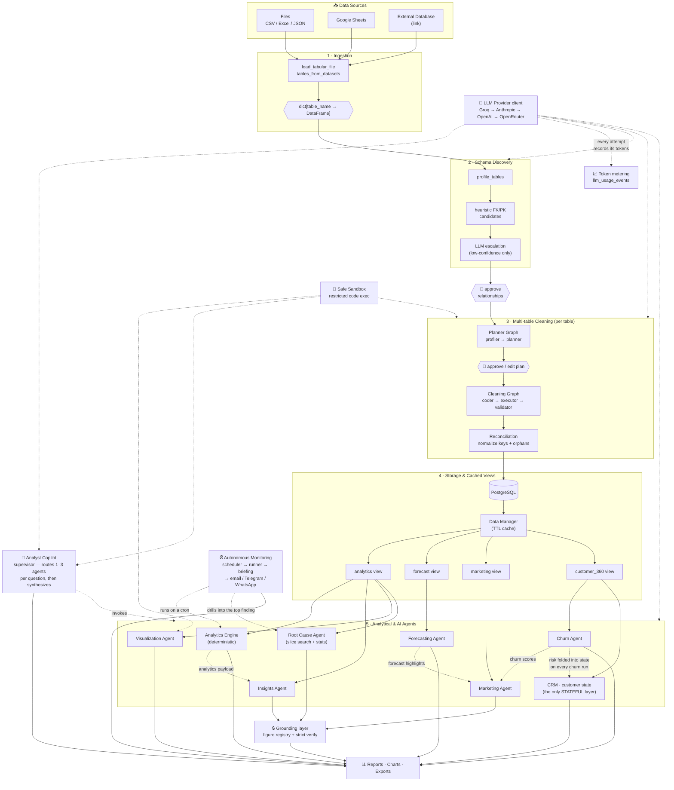

> **Two things this diagram deliberately shows.** The CRM is the only box that
> keeps state between runs — every other agent computes a number and forgets it.
> And Monitoring does not contain analysis of its own: it re-runs the *same*
> engines on a schedule, which is why a scheduled finding and a finding you'd
> get by opening the app can never disagree.

---

## 2 · Cleaning Agent

Two LangGraph state machines (`graphs/planner_graph.py`, `graphs/cleaning_graph.py`)
wrapped by a per-table orchestrator (`agents/cleaning/multi_table.py`).

**Rebuilt 2026-08-08 around deterministic operators.** The LLM *plans*; it no
longer *executes*. A typed plan runs as operators from
`tools/cleaning_ops.py`'s registry (21 of them), and each step's effect is
**measured by diffing the frame** rather than reported by the code that made the
change. The coder is now a no-op for a fully-typed plan — the normal case — and
is invoked only for free-text steps a user typed by hand, which run *after* the
operators, in the sandbox, on the already-cleaned frame.

Everything then passes `agents/cleaning/invariants.py`, the authorization gate:
a step may only touch what the plan named. Retries exist only because generated
code can be wrong in fixable ways — a *typed* plan that fails invariants means an
operator bug, so it goes straight to END rather than re-running something that
would be byte-for-byte identical.

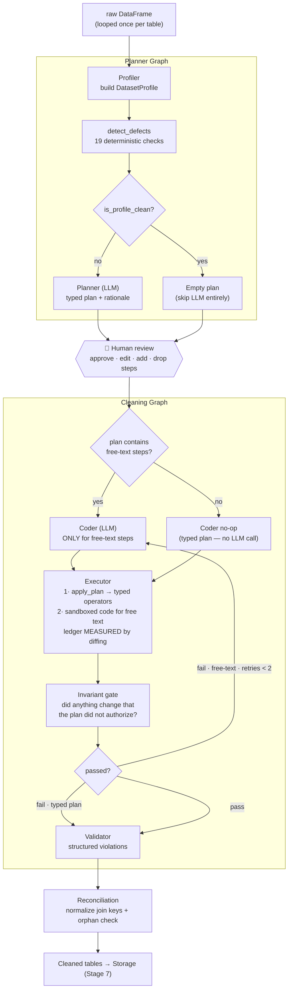

---

## 3 · Schema Discovery Agent

Heuristics first, LLM only for the ambiguous cases. Fails **open** — an LLM
error keeps the heuristic verdict. Only the two candidate columns are ever sent
to the LLM, never the full schema.

```mermaid
flowchart LR
    T["dict[table → DataFrame]"] --> P["profile_tables<br/>row / column profiles"]
    T --> H["find_relationship_candidates"]

    subgraph H2["Heuristic signals (weighted score)"]
        NAME["fuzzy name similarity<br/>difflib (0.25)"]
        SUFFIX["key suffix<br/>_id / _fk / _ref / id"]
        DT["dtype compatibility (0.15)"]
        UNIQ["PK uniqueness (0.30)"]
        COV["FK coverage /<br/>value overlap (0.30)"]
    end

    H --> H2 --> C["candidates + confidence<br/>(best pair per table-pair)"]
    C --> THRESH{"confidence ≥<br/>threshold?"}
    THRESH -- "yes" --> KEEP["accept (source = heuristic)"]
    THRESH -- "no" --> LLM["LLM escalation<br/>only the 2 ambiguous columns sent"]
    LLM -- "ok" --> ADJ["re-scored (source = llm)"]
    LLM -. "on error" .-> FAILOPEN["keep heuristic verdict"]
    KEEP --> RESULT["SchemaDiscoveryResult<br/>tables + candidates"]
    ADJ --> RESULT
    FAILOPEN --> RESULT
```

---

## 4 · Analytics Engine

Pure deterministic (no LLM). Produces the analytics payload the **Insights agent**
and the **KPI dashboard** build on (Visualization reads the raw view instead, and
the Copilot reaches this only via its Insights tool).

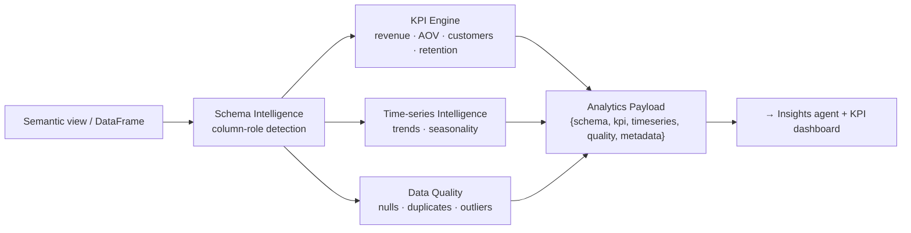

---

## 5 · Insights Agent

**Rebuilt 2026-08-04 so the model never types a digit.** Checking a model's
numbers afterwards can only ever *catch* fabrication, and it catches it
probabilistically — a wrong figure that lands near some value in a big nested
payload coincidentally "verifies". So the flow is inverted: every number the
report is allowed to contain is computed *first* into a **FigureRegistry**, each
with an exact value, the display string it must be printed as, and the formula
it came from. The model is then told to write **citation tokens**
(`{{revenue_total}}`) and `render()` substitutes the registered display strings
server-side. A cited number is not checked — it *cannot* be wrong.

`strict_verify` closes the other half: numbers the model typed as digits anyway
are checked against that closed ~100-figure allow-list, not against every
numeric leaf in the payload, so a coincidental match is far harder. Anything
unverified triggers one self-correction pass naming the exact sentence.

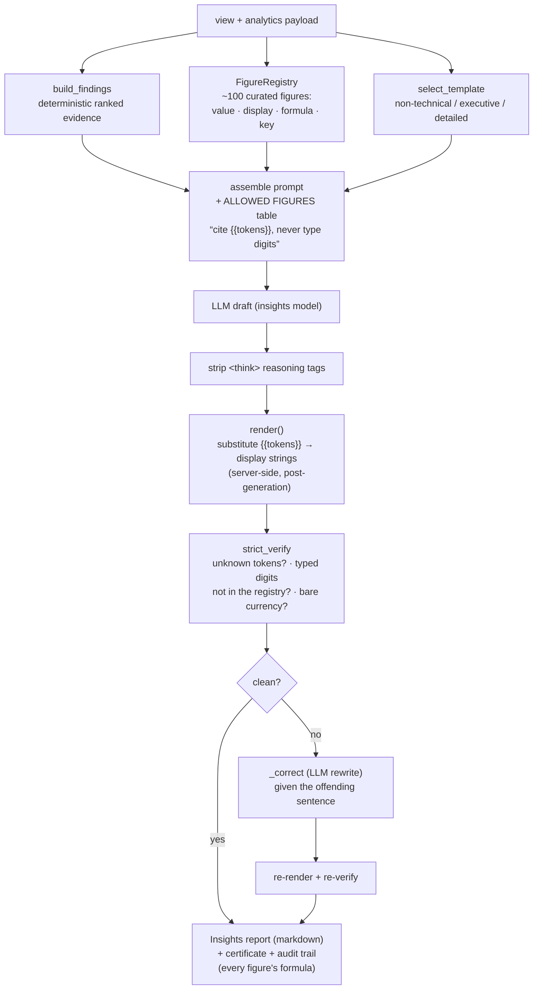

---

## 6 · Visualization Agent

LLM writes Plotly code; a sandboxed executor runs it under a 30-second timeout
and retries the coder on failure. Output figures are sanitized and themed.

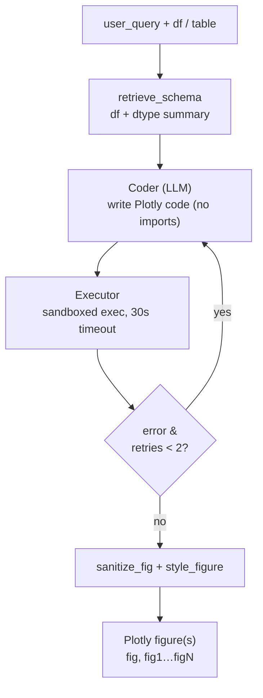

---

## 7 · Forecasting Agent

LangGraph: `validate → prepare → forecast → interpret`. Each metric is forecast
in parallel; the engine back-tests several candidate models and auto-selects the
best by out-of-sample error.

**Rebuilt 2026-08-03.** Measurement showed daily point-forecasts sitting at the
series' own noise floor — no model choice moves that — so the engine's bet
shifted to the two things that *are* improvable: **horizon totals** (what the
next 30 days add up to, which is the number a business actually plans against)
and **calibrated intervals** via conformal prediction (`tools/conformal.py`),
where an 80% band is measured to contain the truth ~80% of the time rather than
merely being labelled 80%. Selection uses **MASE** with a 1-standard-error rule,
preferring the simpler model when candidates are statistically tied.

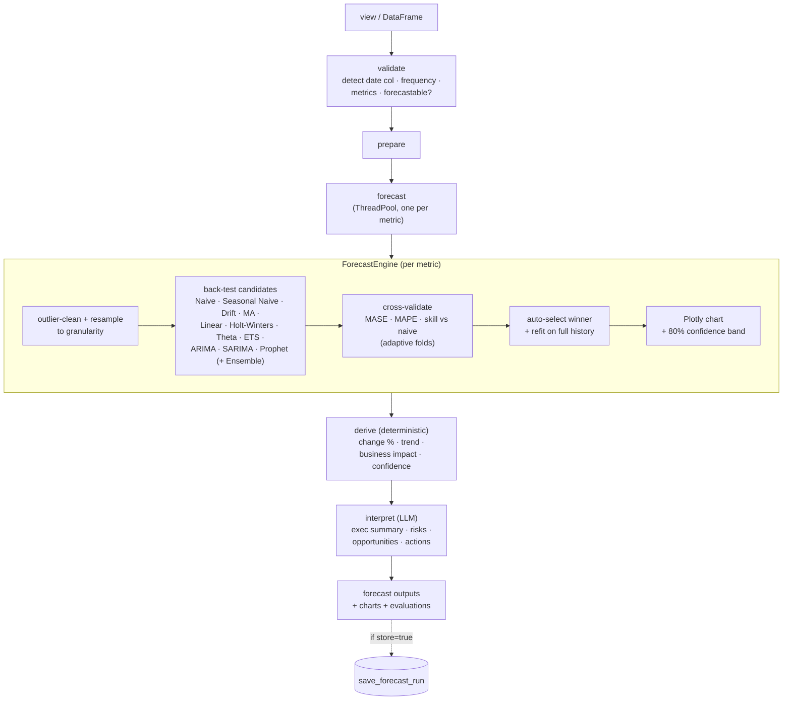

---

## 8 · Churn Agent

Deterministic engine trains a churn model (heuristic fallback), scores every
customer, and computes **per-customer SHAP drivers** only for the ones shown.
The LLM turns the payload into a retention strategy — grounded by a payload-only
prompt (underscore-prefixed internals are stripped), though not run through the
formal `verify_report` check that Insights/Marketing use. Scores also feed the
Marketing Agent.

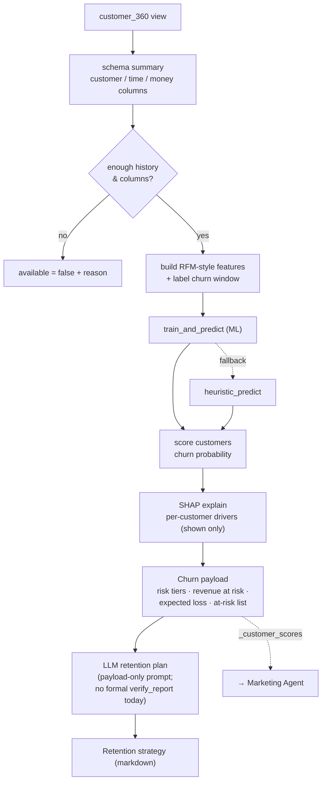

---

## 9 · Marketing Agent

Deterministic RFM segmentation + marketing KPIs + channel breakdown, optionally
folding in the Churn agent's model scores (and Forecast highlights). The LLM
produces three artifacts — a strategy report, a campaign plan, and ad copy — of
which the **strategy report** is the one run through `verify_report`.

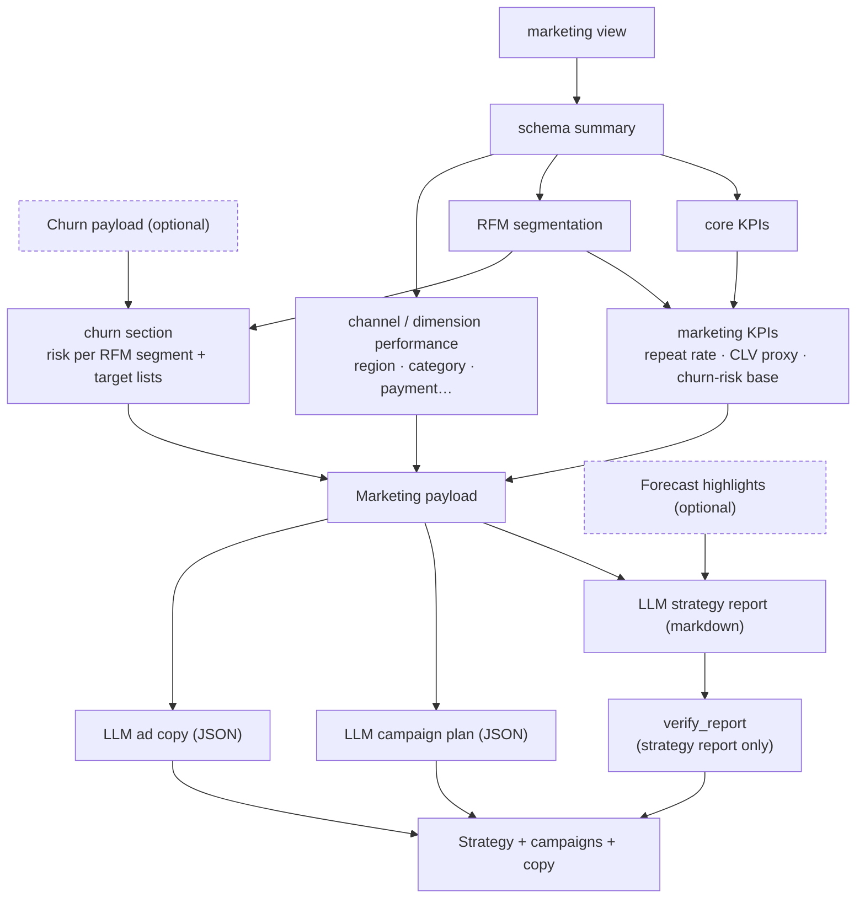

---

## 10 · Analyst Copilot Agent

One structured planner call decomposes a turn into `clarify`, `follow_up`, or an
ordered list of **1–3 tool steps**. Single-step turns are narrated; multi-step
turns are synthesized over the union of every tool's payload. Everything streams
to the user token-by-token over SSE.

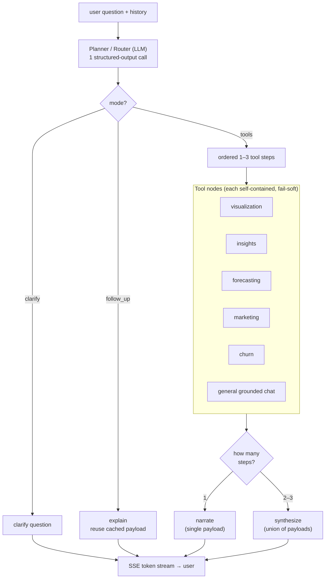

---

## 11 · Grounding / Verification layer

**Two mechanisms, not one**, and the difference matters. Prevention makes a
fabricated number structurally impossible; detection only makes it probable that
you notice. The platform now leads with prevention and keeps detection as the
backstop for anything that slips past it.

| | Mechanism | Where | Guarantee |
|---|---|---|---|
| **Prevention** | Figure registry + citation tokens; engine substitutes every value | Insights, Root Cause | A cited number *cannot* be wrong |
| **Detection (strict)** | Typed digits checked against a closed ~100-figure allow-list | Insights, Root Cause | Coincidental "verification" is hard |
| **Detection (general)** | `verify_report`: figures matched against payload leaves, label-bound where possible | Marketing, Copilot, Churn | Catches most fabrication; probabilistic |

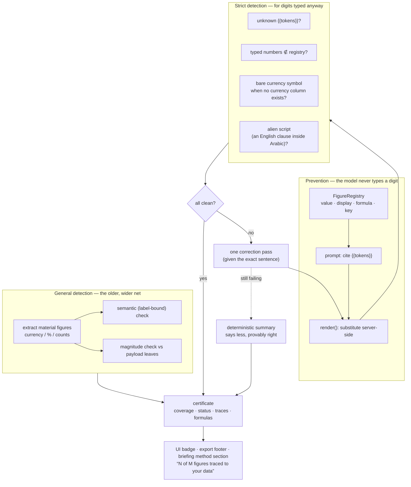

> The fallback edge is the one people miss: when a draft cannot be verified it is
> **discarded**, not patched — replaced by a deterministic summary that says less
> and is provably right. Downstream that fact is *reported*, not hidden: the
> scheduled briefing's method section states when the model's draft was rejected.

---

## 12 · Root Cause Agent

Answers *"why did revenue fall?"* by finding the **smallest slice of the business
that explains the largest part of a change**. The hard part is not the search but
knowing when to believe it: testing thousands of slices guarantees some will look
significant by chance, so the threshold is corrected for how many were tested, and
a finding that fails that bar is reported as a **lead, not a cause**.

The search is a beam search over dimension combinations with a node budget —
exhaustive enumeration is combinatorial and pointless, since most slices are too
small to matter. Pruning happens on support (too few rows), a magnitude bound (this
slice cannot possibly explain enough), the beam, and redundancy (the same slice
reached by a different predicate order).

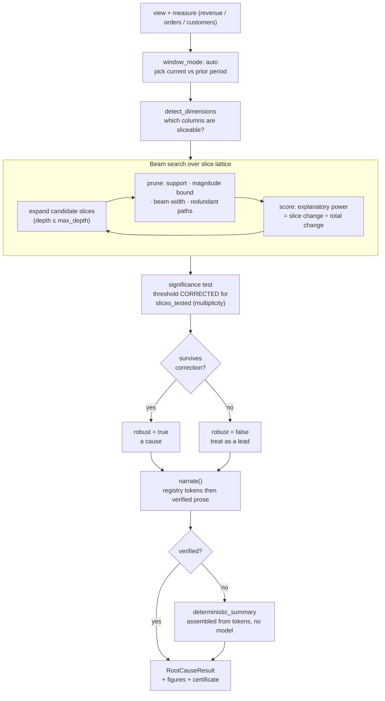

> A null result is a real answer here. When no slice explains the change, the
> agent says so rather than promoting the best of a bad set — and there is a
> regression test pinning exactly that.

---

## 13 · Autonomous Monitoring (Pillar III)

The platform stops waiting to be opened. A `Schedule` says *when* to look and
*what matters*; a run evaluates the same engines the UI uses, ranks findings by
money at stake, drills into the largest one, and pushes a briefing.

Three design decisions carry most of the weight:

* **No model in the delivery path.** The briefing is templates over
  already-computed figures, so it sends at 07:00 whether or not an LLM provider
  is reachable or in credit. A verified narrative is *included* when one exists;
  without it the briefing is shorter, never absent.
* **The `Schedule` table is the source of truth**, not APScheduler's job store —
  a second record of the same fact can disagree, and the classic symptom is a
  deleted schedule that keeps firing. Reconciled every 60s.
* **A Postgres advisory lock per run.** Two workers, or a manual run racing the
  cron, must not double-deliver. The lock releases automatically if the process
  dies holding it.

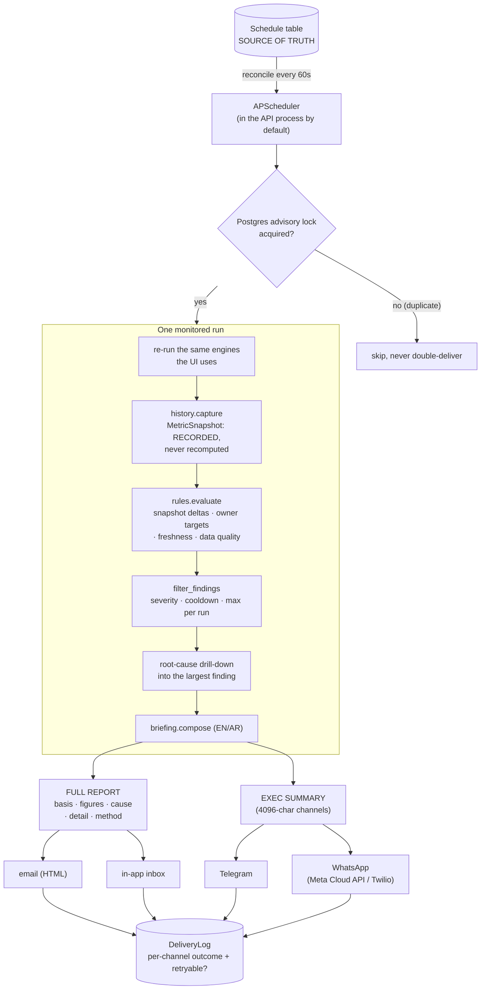

**Why two renderings.** WhatsApp and Telegram cut at 4096 characters, and the
evidence sections sit lowest in the report — so truncation would remove the
figures and the method first, leaving conclusions with nothing backing them. A
test pins that the summary can never state a figure the full report does not.

**Comparing today to yesterday requires yesterday to have been recorded.**
`MetricSnapshot` exists because recomputing the prior period from the current
dataset silently answers a different question every time the data is re-cleaned
or backfilled.

---

## 14 · CRM — customer state (Pillar II Stage 0)

The platform's **only stateful layer**. Every other engine computes a number and
forgets it, which is fine for a report and fatal for a CRM: *"was this customer
riskier last month?"* cannot be answered by recomputing, because recomputing
answers a different question that happens to produce a similar-looking number.

The package is split along a strict seam — `snapshot.py` never touches the
database and `repository.py` never computes anything — which is what lets the
compute be tested against a CSV with no Postgres, and the persistence against
Postgres with no dataset.

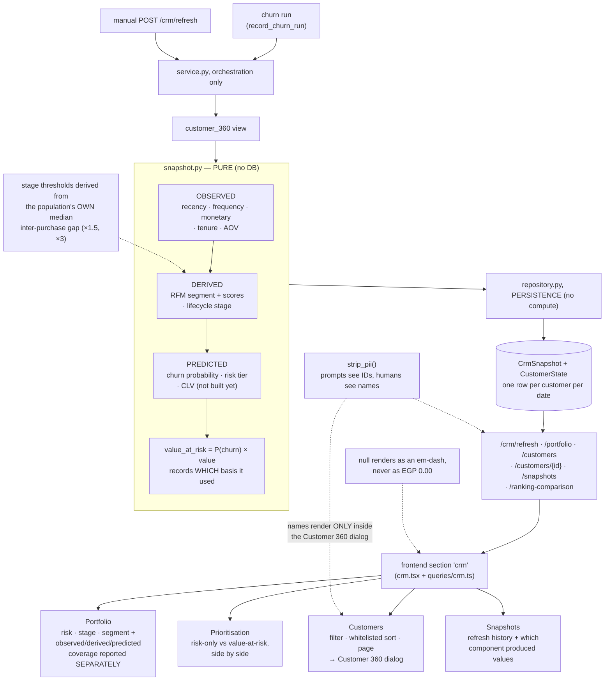

**The provenance rule.** Observed, then derived, then predicted — computed in that
order, and **a later layer never overwrites an earlier one**. So when the churn
model cannot fit, you still get the whole customer book with segments and
lifecycle stages instead of losing everything.

**Self-calibrating lifecycle.** Hardcoding "dormant after 90 days" is wrong in
both directions at once — far too patient for a coffee shop, far too aggressive
for annual insurance. Thresholds are multiples of the population's own median
inter-purchase interval, and the rule is published with the snapshot so it can be
checked.

---

## 15 · LLM token metering

Every provider SDK returns exact token counts and all eight handlers were
discarding them. The awkward constraint: `complete()` returns a bare `str` and
has **23 call sites**, so changing its return type would touch every agent.
Instead the client **pushes** events to a sink installed in the surrounding
context — metering is invisible to callers and no agent knows it exists.

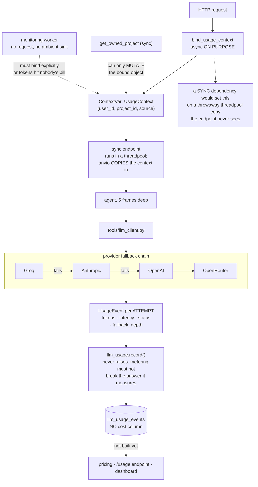

**The streaming trap.** Usage arrives on a final chunk whose `choices` list is
**empty** — exactly what the stream loops were skipping with
`if not chunk.choices: continue` — and OpenAI-compatible providers only send that
chunk when asked via `stream_options={"include_usage": True}`. Copilot is entirely
streamed, so without both fixes the meter would have under-reported the single
heaviest surface in the product while looking perfectly healthy.

**One row per *attempt*, not per call.** A chain that tries Groq, gets
rate-limited, and succeeds on Anthropic writes two rows. Collapsing that into one
"successful" row would hide a chain quietly running on its second choice — which
is a bill nobody predicted.

**No cost column, deliberately.** Token counts are ground truth and never change;
a stored cost silently rots as provider prices drift. Cost belongs at read time
against a dated price list, clearly labelled an estimate.

---

## 16 · Web application surface

Every diagram above stops at the API. This one is what sits on top: **15 authenticated
sections**, each a route + a section component + a `queries/` file, all reaching the
backend through **one** typed fetch wrapper. The shape is deliberately boring and
repetitive — adding an agent means adding one of each, and nothing else moves.

Three things are worth reading off it. Server state lives **only** in react-query;
Zustand holds UI-only state (active section, active project, cross-page artifacts),
so there is no second copy of a server value that can go stale. The **project id is
the axis of the whole app** — nearly every hook is keyed by it, which is why
switching projects invalidates rather than merges. And **auth is bridged, not
duplicated**: NextAuth holds the session, but the token it carries is the FastAPI
JWT, so the browser never has an identity the backend didn't issue.

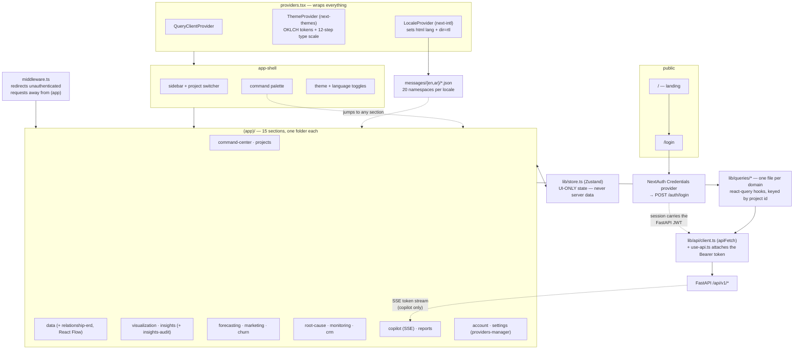

**One deviation from the pattern, and it earns it.** Every hook above is
request/response through `apiFetch`; Copilot instead consumes a
`text/event-stream` (`meta → step → token → done`), because a multi-agent answer
that takes 20 seconds to assemble and arrives all at once reads as a hang. It is
the only surface allowed to bypass the shared client.

**Why sections own their translations.** `messages/` is split into 20 namespace
pairs rather than two big files, so two translation passes never touch the same
file and a missing key blanks one screen instead of the app. Arabic prose that
carries numbers is composed rather than translated — that logic lives on the
server (`monitoring/evidence_ar.py`, `tools/localize.py`), not here.
